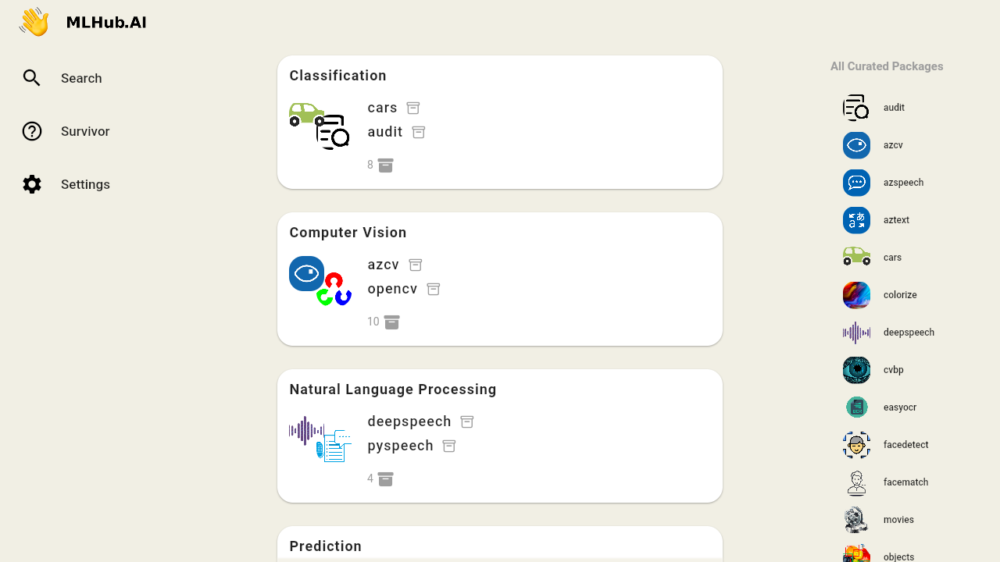
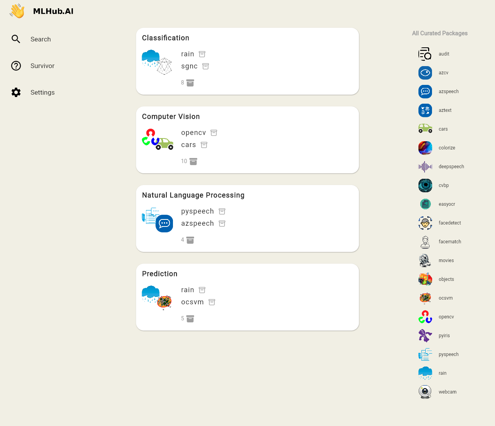
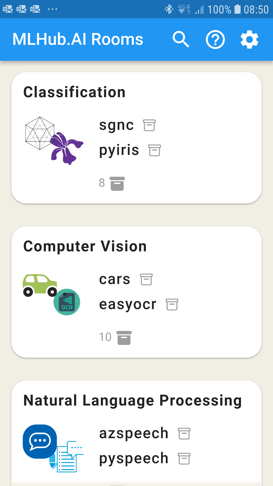
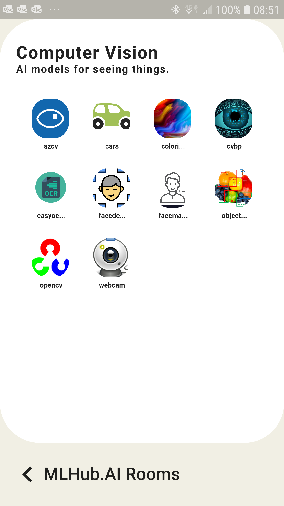

# A Sample Flutter app for MLHub

Demonstrate a single app that can target all platforms.

## Sample Targets

### Linux

```
$ flutter run -d linux
```



### JavaScript

```
$ flutter run -d chrome
```



### Android

```
$ flutter run -d ae0357086141376d1
```
Home | Room
:---:|:---:
 | 
