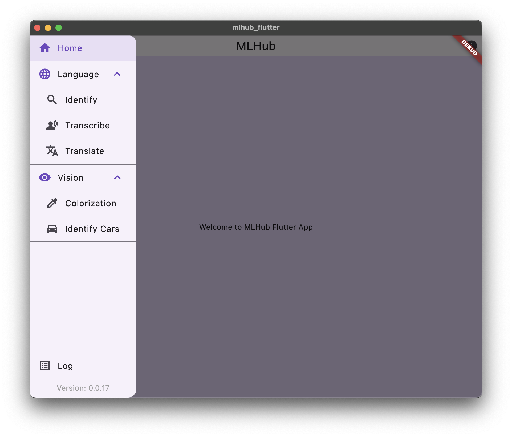
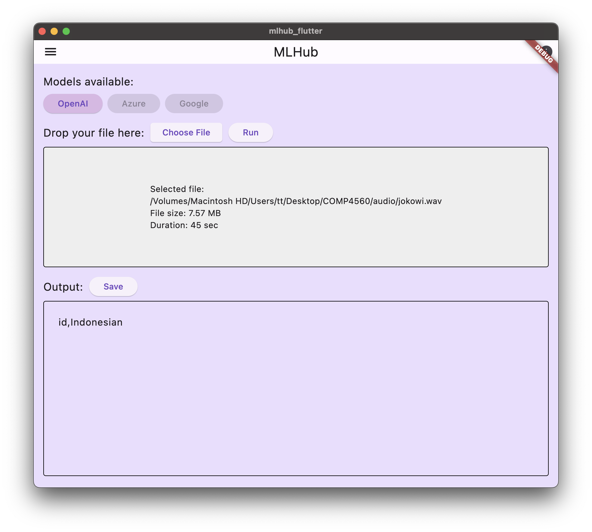
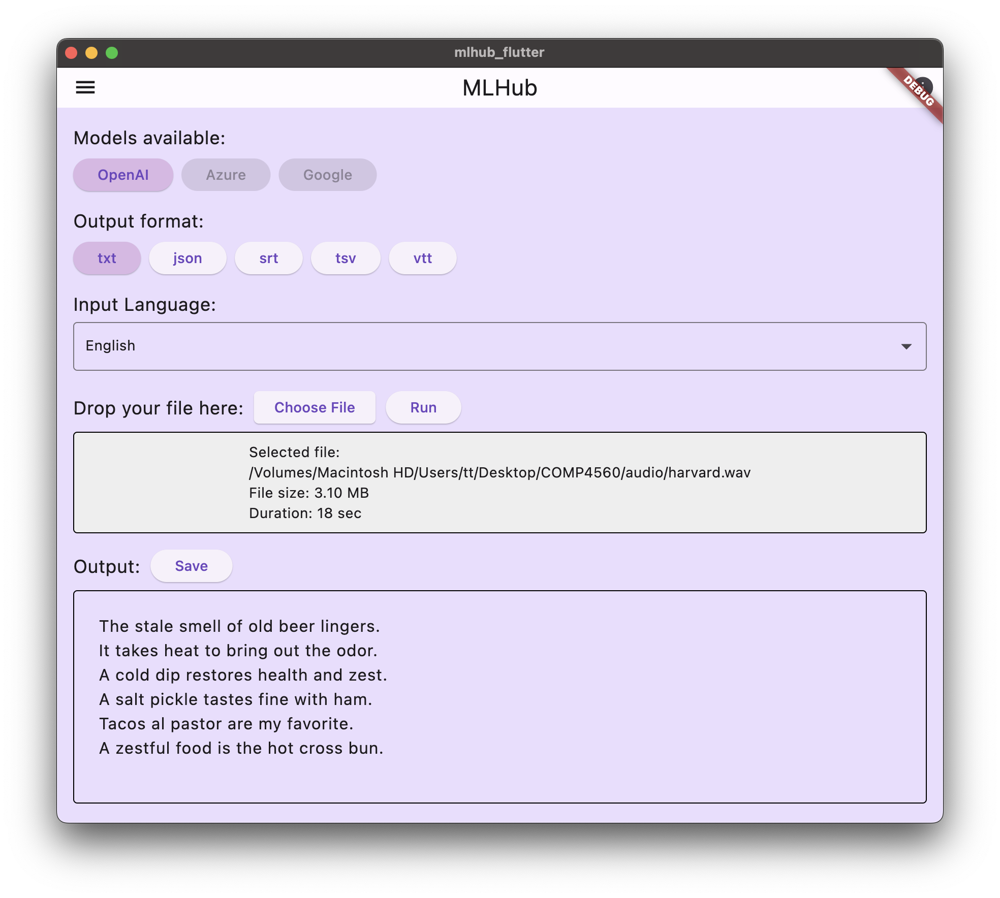
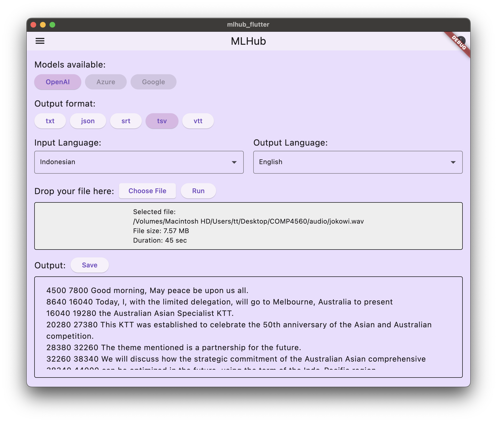
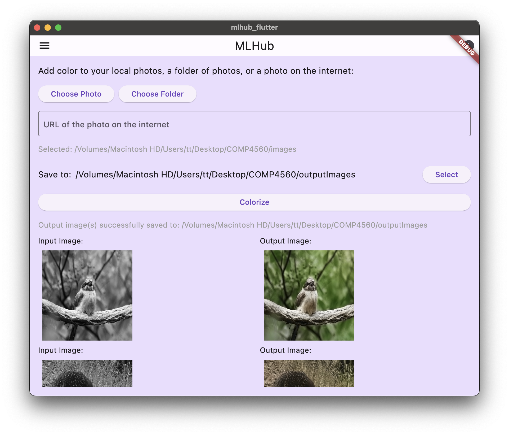
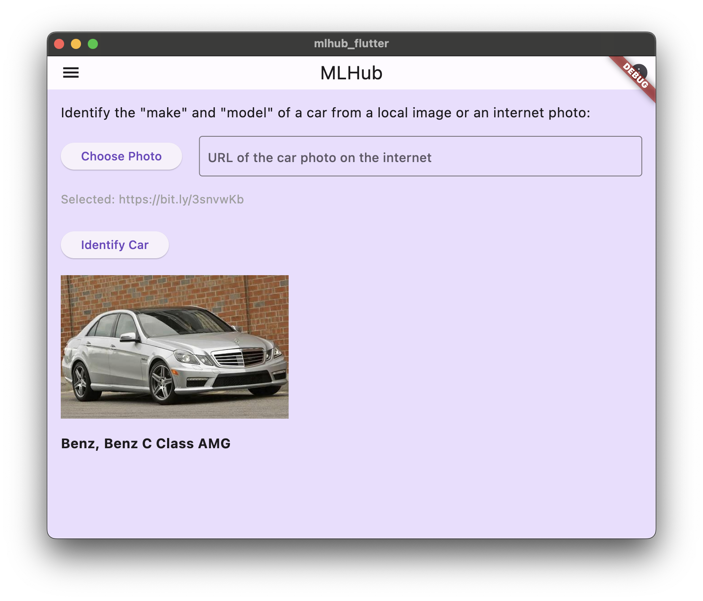
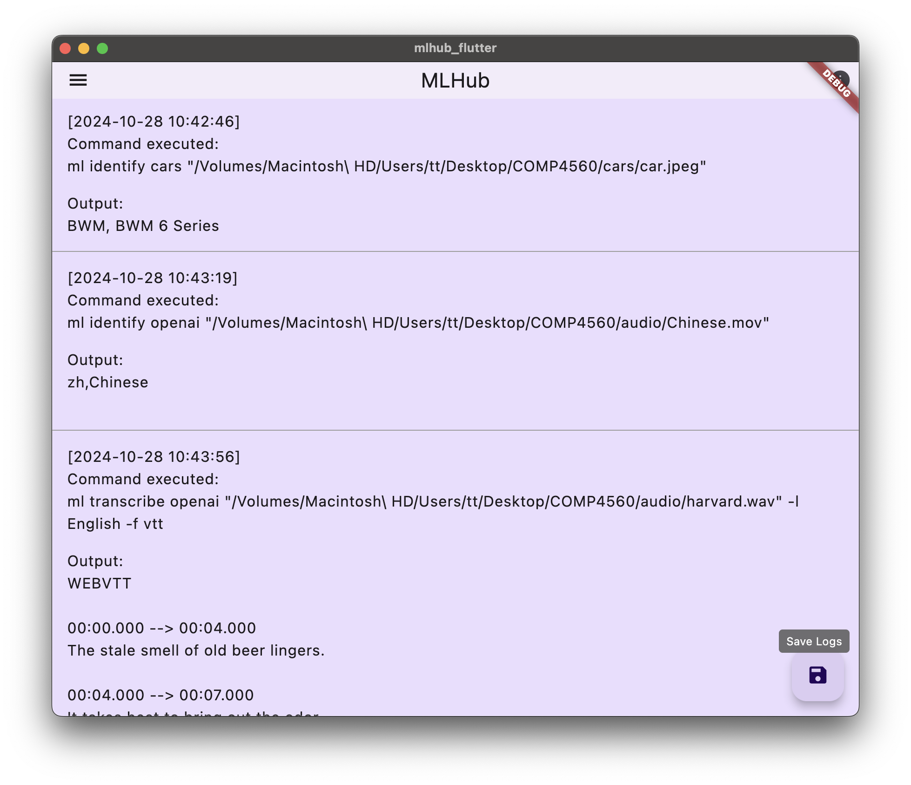

# ML Flutter &mdash; Simplifying Access AI/ML Models

MLFlutter aims to be a simplified gateway to provide access to
artificial intelligence and machine learning models based on the
MLHub framework.

## Installation

See file:installers/README.md for installation instructions.

## Features

ML Flutter offers a variety of features designed to make accessing and utilizing AI tools straightforward.  

Overview of the app with the navigation drawer:

Below are some of the key functionalities:

### Language
#### Language Identification
Identify the language of any input audio or video file.

#### Transcription
Convert the content of the input audio/video file into formatted text.

#### Translation
Translate the content of the input audio/video file into formatted text. (Note: Currently, only supported to translate to English.)

### Vision
#### Colorization
Colorize black-and-white images from an image input, a folder of images or the URL of an image.

#### Identify Cars
Identify the make and model of a car from an image input.

### Log
The Log page displays all the commands executed and their outputs.

